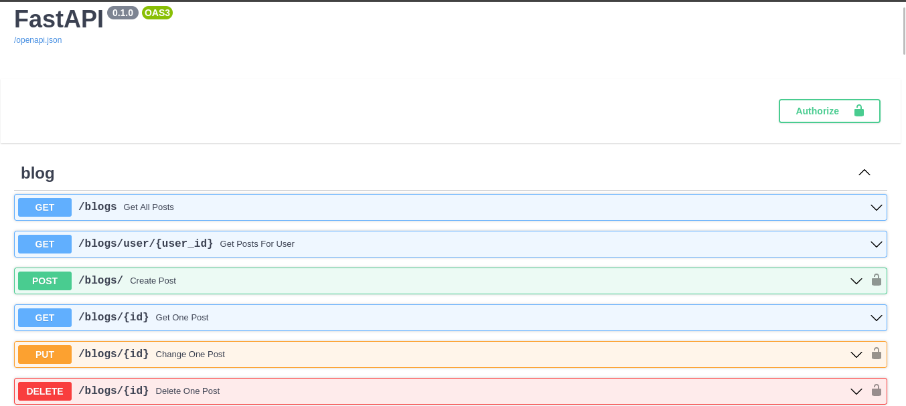
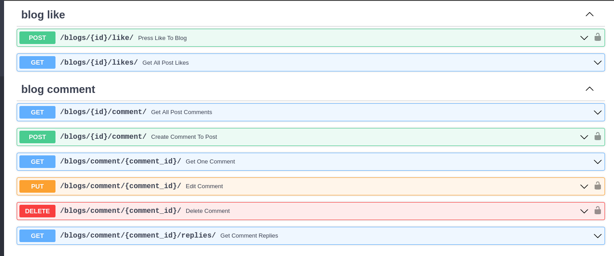
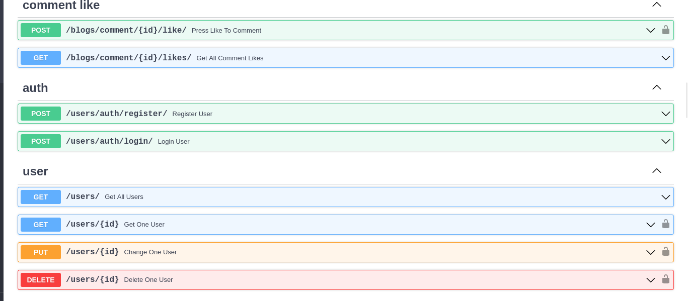

# Blog

This is a blog service built on FastAPI with TurtoiseORM, [similar project written on Django](https://github.com/YaroslavYaryk/Django-React-blog)


## Instalation

Clone the project

```bash
  git clone https://github.com/YaroslavYaryk/fastapi-tortoiseORM-blog.git
```

Go to the project directory

```bash
  cd fastapi-tortoiseORM-blog
```


Install dependencies

```bash
  pip install -r requirements.txt
```

Start the server

```bash
  uvicorn main:app --reload
```

## Screenshots





